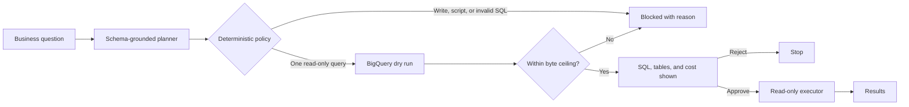

# SQL Execution Gate

AI agents should not execute consequential actions merely because their output
looks plausible.

SQL Execution Gate converts a business question into schema-grounded SQL, shows
the exact query, referenced tables, and estimated scan cost, and requires
explicit human approval before a mechanically read-only executor can run it.

[Try the live demo](https://fsbq-agent-bqjiefengq-uc.a.run.app/app/)

## The failure this prevents

An analytics agent can hallucinate a table, generate an expensive query, or
silently reinterpret a business question. This gate separates planning,
validation, approval, and execution so failure remains inspectable and
recoverable.

An explicit write request is stopped before the agent is invoked. Generated SQL
must then pass a BigQuery parser policy and dry run before the approval button is
enabled. The executor repeats those checks and runs through ADK's
`WriteMode.BLOCKED` tool configuration.

## Architecture



## Three guarantees

1. **Planning cannot execute.** The SQL planner has no BigQuery execution tool,
   and automatic function calling is disabled.
2. **Approval contains evidence.** The UI shows the exact SQL, physical tables,
   dry-run byte estimate, and enforced 1 GB ceiling before approval is enabled.
3. **Execution fails closed.** SQL is parsed and dry-run again immediately
   before execution, while `WriteMode.BLOCKED` provides a final read-only
   boundary.

## Adversarial path

Try:

```text
Delete all cancelled orders and return the remaining revenue.
```

The request is handled without invoking the planner or submitting a BigQuery
query job:

```text
Blocked: SQL Execution Gate permits read-only queries only.
No BigQuery query job was submitted.
```

This early intent check is deliberately narrow. The stronger boundary applies
to every generated statement: `sqlglot` accepts exactly one BigQuery query,
rejects DML, DDL, scripts, and unqualified physical tables, and extracts the
tables shown to the reviewer.

## Evidence

The unit suite covers parser policy, DML and multi-statement rejection, dry-run
byte limits, compute-project enforcement, the adversarial request path, the
same-origin server, and approval metadata.

```bash
make test-web
```

Live Gemini and BigQuery workflow tests require Google Cloud credentials:

```bash
make test-hitl
```

## Run locally

Prerequisites: Python 3.12, `uv`, Node.js 22, Google Application Default
Credentials, and access to the configured BigQuery dataset.

Create `.env`:

```dotenv
GOOGLE_GENAI_USE_VERTEXAI=true
GOOGLE_CLOUD_PROJECT=your-compute-project
GOOGLE_CLOUD_LOCATION=global
VERTEX_AI_LOCATION=us-central1

BQ_COMPUTE_PROJECT_ID=your-compute-project
BQ_DATA_PROJECT_ID=bigquery-public-data
BQ_DATASET_ID=thelook_ecommerce
BQ_MAXIMUM_BYTES_BILLED=1000000000
DATASET_CONFIG_FILE=config/datasets/thelook_ecommerce_dataset_config.json

ROOT_AGENT_MODEL=gemini-2.5-flash
BIGQUERY_AGENT_MODEL=gemini-2.5-flash
BIGQUERY_PLANNER_MODEL=gemini-3.1-pro-preview
ANALYTICS_AGENT_MODEL=gemini-2.5-flash
ENABLE_BQML=false
```

```bash
make install
make dev
```

Open `http://localhost:5173/app/`. For production parity, run `make
build-frontend && make serve` and open `http://localhost:8080/app/`.

## Deployment

The active deployment path is Cloud Run through `cloudbuild-infra.yaml` and
`cloudbuild.yaml`. The compute project pays for query jobs while fully qualified
tables can remain in `bigquery-public-data`.

See [docs/DEPLOYMENT.md](docs/DEPLOYMENT.md) for reproducible deployment steps.
The existing internal Cloud Run service and Terraform state identifiers retain
their original names to avoid a state migration before review.

## Positioning

SQL Execution Gate demonstrates the same principle as the Physical AI Release
Gate: separate probabilistic AI decisions from consequential execution using
inspectable, measurable controls.

This project began with Google's ADK Agent Starter Pack and BigQuery samples.
Google-authored files retain their copyright headers; the gate policy, HITL
topology, approval evidence UI, failure tests, and Cloud Run delivery path are
project-specific work.
