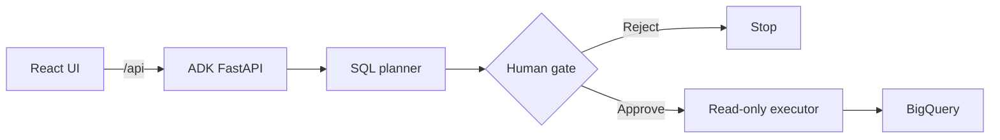

# FSBQ Agent

**A safety-gated BigQuery assistant that separates SQL planning from
execution.**

FSBQ converts a business question into grounded BigQuery SQL, shows the exact
query to the user, and waits for an explicit approve/reject decision before
continuing. The SQL executor uses ADK's `WriteMode.BLOCKED`; BQML is disabled by
default and must be explicitly enabled.

> **Start here:** [Run locally](#run-locally) for a quick evaluation, or follow
> [Deploy FSBQ in your own Google Cloud project](docs/DEPLOYMENT.md) for the
> complete, independently reproducible setup.

> **Deployment status:** the production container, Terraform stack, and Cloud
> Build pipeline are ready. Add the verified Cloud Run URL here after the first
> deployment.

## What the demo proves

- The agent loads the current BigQuery schema rather than relying on a static
  table description.
- SQL planning and SQL execution are separate ADK agents.
- The browser renders generated SQL in an explicit human-approval card.
- Rejecting sends `no`; approving sends `yes` into the same ADK session.
- The standard SQL executor is mechanically read-only.
- A failed execution stops instead of silently regenerating and executing a
  replacement query.
- Substantive chat requests are capped per visitor using
  `usage_limits.max_user_queries` in `config/config.yaml`; approval replies do
  not consume the allowance.

## Architecture



The local Vite server proxies `/api/*` to ADK on port `8000`. The production
server mounts ADK at `/api` and serves the compiled React application at `/app`
from one process on Cloud Run port `8080`.

## Safety boundary

| Layer | Guarantee |
|---|---|
| Frontend | Makes the proposed SQL and approve/reject decision visible |
| Agent topology | Keeps SQL generation separate from the tool-bearing executor |
| BigQuery tool | `WriteMode.BLOCKED` rejects standard SQL writes |
| Cloud Run configuration | Sets `ENABLE_BQML=false` |
| Tests | Cover same-origin routing, packaged UI behavior, and the fail-closed HITL scenario |

The UI is not an authorization system. Production access control must still be
enforced through the Cloud Run service identity and BigQuery IAM.

## Run locally

Prerequisites: Python 3.12, `uv`, Node.js 22, Google Application Default
Credentials, and access to the configured BigQuery dataset.

Create `.env` from the values used by your working local setup:

```dotenv
GOOGLE_GENAI_USE_VERTEXAI=true
GOOGLE_CLOUD_PROJECT=gcplab20250706
GOOGLE_CLOUD_LOCATION=global
VERTEX_AI_LOCATION=us-central1
GOOGLE_APPLICATION_CREDENTIALS=/path/to/credentials.json

BQ_COMPUTE_PROJECT_ID=gcplab20250706
BQ_DATA_PROJECT_ID=bigquery-public-data
BQ_DATASET_ID=thelook_ecommerce
DATASET_CONFIG_FILE=config/datasets/thelook_ecommerce_dataset_config.json

ROOT_AGENT_MODEL=gemini-2.5-flash
BIGQUERY_AGENT_MODEL=gemini-2.5-flash
BIGQUERY_PLANNER_MODEL=gemini-3.1-pro-preview
ANALYTICS_AGENT_MODEL=gemini-2.5-flash
BQML_AGENT_MODEL=gemini-2.5-flash
CRITIC_MODEL=gemini-2.5-flash
WORKER_MODEL=gemini-2.5-flash
ENABLE_BQML=false
```

Install and start the development stack:

```bash
make install
make dev
```

Open `http://localhost:5173/app/`.

For production parity:

```bash
make build-frontend
make serve
```

Open `http://localhost:8080/app/`.

## Validate

Credential-free checks:

```bash
npm --prefix frontend ci
npm --prefix frontend run lint
npm --prefix frontend run build
uv sync --frozen
uv run pytest tests/unit -v
```

The live HITL tests call Gemini and BigQuery, so they require the environment and
credentials above:

```bash
uv run pytest tests/test_hitl_workflow.py -v
```

## Deploy to Cloud Run

Follow [the independent deployment guide](docs/DEPLOYMENT.md). It covers GCP
project and dataset preparation, one-time Terraform bootstrap, infrastructure
deployment, application deployment, smoke tests, and teardown without relying
on the author's project-specific values.

`cloudbuild-infra.yaml` owns APIs, IAM, service accounts, Artifact Registry,
Cloud Run configuration, and the optional trigger. It uses a locked GCS backend
instead of ephemeral build-local state.

`cloudbuild.yaml` tests both application layers, publishes an immutable
Artifact Registry image, updates the Terraform-created `fsbq-agent` service,
and checks both `/api/list-apps` and `/app/`. Cloud Run uses `/healthz` for its
internal startup and liveness probes.

The demo is intentionally limited to one Cloud Run instance because ADK
sessions are currently held in memory. Add a shared session service before
raising that limit.

## Provenance

This repository began with Google's ADK Agent Starter Pack and BigQuery agent
samples. Google-authored files retain their copyright headers. The FSBQ-specific
work includes the planner/executor HITL flow, failure-path tests, approval
interface, unified React/FastAPI runtime, and Cloud Run delivery stack.

See [CONTINUATION_README.md](CONTINUATION_README.md) for the detailed agent
contracts and remaining evidence gaps.
